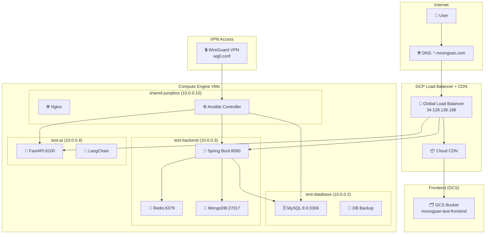

# 🏗️ Test Moongsan 3-Tier Infrastructure Complete Guide

> **통합 3-tier GCP 아키텍처 완전 가이드**  
> Test 환경 완료, Production 배포 준비 완료

## 📋 목차

1. [프로젝트 개요](#프로젝트-개요)
2. [아키텍처 개요](#아키텍처-개요)
3. [Terraform 인프라](#terraform-인프라)
4. [Ansible 배포 자동화](#ansible-배포-자동화)
5. [WireGuard VPN](#wireguard-vpn)
6. [환경별 설정](#환경별-설정)
7. [배포 가이드](#배포-가이드)
8. [운영 가이드](#운영-가이드)
9. [트러블슈팅](#트러블슈팅)
10. [다음 단계 (Prod 마이그레이션)](#다음-단계-prod-마이그레이션)

---

## 🎯 프로젝트 개요

### **프로젝트 정보**
- **프로젝트명**: Moongsan 3-tier E-commerce Platform
- **GCP 프로젝트**: `ktb-2-moongsan`
- **Repository**: 
  - Frontend: `https://github.com/100-hours-a-week/14-YG-FE.git`
  - Backend: `https://github.com/100-hours-a-week/14-YG-BE.git`
  - AI Service: `https://github.com/100-hours-a-week/14-YG-AI.git`
  - Infrastructure: `https://github.com/100-hours-a-week/14-YG-CLOUD.git`

### **기술 스택**
```yaml
Frontend:
  - React 18 + Vite
  - TypeScript
  - Deployment: GCS + Cloud CDN

Backend:
  - Spring Boot 3.x
  - Java 17
  - MySQL 8.0
  - Redis (캐싱)
  - MongoDB (채팅)
  - Deployment: Docker on Compute Engine

AI Service:
  - Python FastAPI
  - LangChain
  - OpenAI API
  - Deployment: Docker on Compute Engine

Infrastructure:
  - Terraform (IaC)
  - Ansible (Configuration Management)
  - GCP (Cloud Provider)
  - WireGuard VPN
```

---

## 🏛️ 아키텍처 개요

### **현재 구현된 아키텍처 (Option 4: 통합 LB+CDN)**



### **라우팅 규칙**
```yaml
https://test.moongsan.com/          # → GCS (React SPA)
https://test.moongsan.com/api/*     # → Backend (Spring Boot)
https://test.moongsan.com/ai/*      # → AI Service (FastAPI)
```

### **네트워크 구성**
```yaml
VPC: moongsan-test-vpc (10.0.0.0/16)
Subnets:
  - moongsan-test-subnet: 10.0.0.0/24 (asia-northeast3-a)
  
VMs:
  - test-database: 10.0.0.2 (MySQL, e2-medium)
  - test-backend: 10.0.0.3 (Spring Boot, e2-medium) 
  - test-ai: 10.0.0.4 (FastAPI, e2-medium)
  - shared-jumpbox: 10.0.0.10 (Ansible, e2-micro)

External IPs:
  - Load Balancer: 34.128.136.186
  - shared-jumpbox: 35.216.83.208 (관리용)
```

---

## ⚡ Terraform 인프라

### **디렉토리 구조**
```
terraform/
├── terraform.tfstate              # 글로벌 상태
├── variables.tf                   # 글로벌 변수
├── bootstrap/                     # 초기 설정 (완료)
│   ├── main.tf
│   ├── outputs.tf
│   └── variables.tf
├── environments/                  # 환경별 설정
│   ├── shared/                    # 공유 리소스 (완료)
│   │   ├── main.tf
│   │   ├── outputs.tf
│   │   └── variables.tf
│   ├── test/                      # 테스트 환경 (완료)
│   │   ├── main.tf
│   │   ├── outputs.tf
│   │   └── variables.tf
│   └── prod/                      # 운영 환경 (준비 중)
│       └── backend.tf
└── modules/                       # 재사용 가능한 모듈
    ├── compute/                   # VM 인스턴스
    ├── network/                   # VPC, 서브넷
    ├── storage/                   # GCS 버킷
    ├── gcs_cdn/                   # GCS + CDN (완료)
    ├── load_balancer/             # LB + 백엔드 서비스 (완료)
    └── security/                  # 방화벽, IAM
```

### **주요 모듈 구성**

#### **1. GCS + CDN 모듈** (`modules/gcs_cdn/`)
```hcl
# 핵심 기능
- GCS 버킷 생성 및 웹 호스팅 설정
- 버킷 정책 및 CORS 설정
- 정적 IP 예약
- 자동 SSL 인증서 관리

# 출력
- bucket_name: "moongsan-test-frontend"  
- bucket_url: "gs://moongsan-test-frontend"
- cdn_ip: "34.128.136.186"
```

#### **2. Load Balancer 모듈** (`modules/load_balancer/`)
```hcl
# 핵심 기능
- Global HTTP(S) Load Balancer
- SSL 인증서 자동 프로비저닝
- 백엔드 서비스 (Backend API, AI Service)
- 헬스체크 설정
- URL 맵 및 라우팅 규칙

# 라우팅 규칙
- /* → GCS Backend (정적 콘텐츠)
- /api/* → Backend Service (Spring Boot)
- /ai/* → AI Service (FastAPI)
```

#### **3. Compute 모듈** (`modules/compute/`)
```hcl
# VM 인스턴스 관리
- test-database: e2-medium (MySQL)
- test-backend: e2-medium (Spring Boot + Redis + MongoDB)  
- test-ai: e2-medium (FastAPI)
- shared-jumpbox: e2-micro (Ansible Controller)

# 방화벽 규칙
- HTTP/HTTPS: 80, 443
- Backend API: 8080 (LB 헬스체크만)
- AI Service: 8100 (LB 헬스체크만)
- SSH: 22 (VPN을 통해서만)
- MySQL: 3306 (내부 네트워크만)
```

### **배포 상태**
```yaml
✅ Bootstrap: 완료
  - GCS 백엔드 설정
  - 기본 IAM 역할
  - 초기 프로젝트 설정

✅ Shared: 완료
  - VPC 네트워크
  - 공유 리소스
  - 기본 보안 정책

✅ Test: 완료
  - 전체 3-tier 아키텍처
  - VM 인스턴스 4개
  - LB + CDN 통합
  - SSL 인증서 활성화

🔄 Prod: 준비 중
  - backend.tf 존재
  - main.tf 생성 필요
```

### **Terraform 명령어**
```bash
# 환경별 배포
cd terraform/environments/test
terraform init
terraform plan
terraform apply

# 상태 확인
terraform show
terraform output

# 정리
terraform destroy
```

---

## 🤖 Ansible 배포 자동화

### **디렉토리 구조**
```
ansible/
├── ansible.cfg                   # Ansible 설정
├── .vault_pass.txt              # Vault 패스워드
├── *.ini                        # 환경별 인벤토리
├── group_vars/                  # 환경별 변수 (암호화됨)
│   ├── test/all.yml
│   ├── prod/all.yml
│   └── shared/all.yml
├── playbooks/                   # 플레이북
│   ├── main.yml                 # 🚀 통합 배포 플레이북
│   ├── deploy_shared.yml
│   └── dev_db_fix.yml
└── roles/                       # Ansible 역할
    ├── base_system/             # 기본 시스템 설정
    ├── common/                  # 공통 설정
    ├── database/                # MySQL 설정
    ├── be_deploy/               # Backend 배포
    ├── ai_deploy/               # AI 서비스 배포
    ├── fe_gcs_deploy/           # Frontend GCS 배포 ⭐
    ├── docker_net/              # Docker 네트워킹
    ├── redis/                   # Redis 설정
    ├── mongo/                   # MongoDB 설정
    ├── nginx_conf/              # Nginx 설정
    ├── db_backup/               # DB 백업
    └── wireguard_setup/         # WireGuard VPN
```

### **주요 플레이북**

#### **🚀 통합 배포 플레이북** (`playbooks/main.yml`)
```yaml
# 사용법
ansible-playbook -i test.ini playbooks/main.yml

# 선택적 배포 (태그 사용)
ansible-playbook -i test.ini playbooks/main.yml --tags "frontend"
ansible-playbook -i test.ini playbooks/main.yml --tags "backend,ai"
ansible-playbook -i test.ini playbooks/main.yml --tags "database"

# 배포 단계
1️⃣ 기본 시스템 설정 (base_system, common)
2️⃣ 데이터베이스 배포 (database, db_backup)  
3️⃣ 백엔드 서비스 배포 (docker_net, redis, mongo, be_deploy)
4️⃣ AI 서비스 배포 (ai_deploy)
5️⃣ 프론트엔드 배포 (fe_gcs_deploy) ⭐
✅ 배포 완료 요약
```

#### **⭐ 프론트엔드 GCS 배포** (`roles/fe_gcs_deploy/`)
```yaml
핵심 기능:
  ✅ Node.js 18.x 설치
  ✅ Google Cloud SDK 설치  
  ✅ React 프로젝트 클론 및 빌드
  ✅ 환경별 .env 파일 생성
  ✅ 최적화된 캐시 헤더로 GCS 업로드
  ✅ SPA 라우팅을 위한 404.html 생성
  ✅ Smart CDN 캐시 무효화 ⭐
  ✅ 배포 검증 및 결과 리포트

특별 기능:
  🔄 자동 CDN 캐시 무효화: 새 빌드 즉시 반영
  📦 파일별 캐시 전략:
    - HTML: 5분 캐시 (즉시 업데이트)
    - JS/CSS: 1년 캐시 (해시된 파일명)
    - 이미지: 1일 캐시
  🔗 캐시 우회 URL 자동 생성
```

### **인벤토리 설정**

#### **Test 환경** (`test.ini`)
```ini
[test]
shared-jumpbox ansible_host=35.216.83.208

[database]
test-database ansible_host=10.0.0.2

[backend] 
test-backend ansible_host=10.0.0.3

[ai]
test-ai ansible_host=10.0.0.4

[jumpbox]
shared-jumpbox ansible_host=35.216.83.208

[test:children]
database
backend
ai
jumpbox
```

#### **Prod 환경** (`prod.ini`)
```ini
[prod]
moongsan.com ansible_user=ubuntu

# 변수
[prod:vars]
env=prod
service_name=moongsan
```

### **주요 변수 (암호화됨)**
```yaml
# group_vars/test/all.yml (Ansible Vault로 암호화)
gcp:
  project_id: "ktb-2-moongsan"
  gcs:
    fe:
      bucket_name: "moongsan-test-frontend"
      project: "ktb-2-moongsan"
      cdn_ip: "34.128.136.186"
      domain: "test.moongsan.com"

fe:
  api:
    domain: "test.moongsan.com"
    base_url: "https://test.moongsan.com/api"
    backend_url: "https://test.moongsan.com/api"
    ai_url: "https://test.moongsan.com/ai"

nginx:
  domain: "test.moongsan.com"
```

### **배포 명령어**
```bash
# 전체 배포
ansible-playbook -i test.ini playbooks/main.yml

# 프론트엔드만 배포 (가장 자주 사용)
ansible-playbook -i test.ini playbooks/main.yml --tags "frontend"

# 백엔드 + AI 배포
ansible-playbook -i test.ini playbooks/main.yml --tags "backend,ai"

# 상태 확인
ansible -i test.ini test -m shell -a 'docker ps'
ansible -i test.ini backend -m shell -a 'docker logs be-moongsan'
ansible -i test.ini ai -m shell -a 'docker logs ai-moongsan'
```

---

## 🔒 WireGuard VPN

### **설정 파일 위치**
```
wireguard-server-config/
└── wg0.conf                     # 서버 설정

wireguard-team-keys/             # 클라이언트 설정
├── README.md
├── keys-summary.txt
├── admin-client.conf            # 관리자용
├── admin-client-updated.conf    
├── kane-client.conf             # 개발자별 설정
├── lucy-client.conf
├── milo-client.conf
├── sally-client.conf
├── tony-client.conf
└── test-server.conf
```

### **서버 설정** (`wg0.conf`)
```ini
[Interface]
PrivateKey = [SERVER_PRIVATE_KEY]
Address = 10.8.0.1/24
ListenPort = 51820
PostUp = iptables -A FORWARD -i %i -j ACCEPT; iptables -t nat -A POSTROUTING -o ens4 -j MASQUERADE
PostDown = iptables -D FORWARD -i %i -j ACCEPT; iptables -t nat -D POSTROUTING -o ens4 -j MASQUERADE

# 팀원별 Peer 설정
[Peer]  # Admin
PublicKey = [ADMIN_PUBLIC_KEY]
AllowedIPs = 10.8.0.2/32

[Peer]  # Kane  
PublicKey = [KANE_PUBLIC_KEY]
AllowedIPs = 10.8.0.3/32

# ... 추가 Peer들
```

### **클라이언트 설정 예시** (`admin-client.conf`)
```ini
[Interface]
PrivateKey = [CLIENT_PRIVATE_KEY]
Address = 10.8.0.2/24
DNS = 8.8.8.8

[Peer]
PublicKey = [SERVER_PUBLIC_KEY]  
Endpoint = 35.216.83.208:51820
AllowedIPs = 10.0.0.0/16, 10.8.0.0/24
PersistentKeepalive = 25
```

### **VPN을 통한 접속**
```bash
# WireGuard 연결 후
ssh -i ~/.ssh/lsh-study-key ubuntu@10.0.0.10  # Jumpbox
ssh -i ~/.ssh/lsh-study-key ubuntu@10.0.0.2   # Database
ssh -i ~/.ssh/lsh-study-key ubuntu@10.0.0.3   # Backend  
ssh -i ~/.ssh/lsh-study-key ubuntu@10.0.0.4   # AI Service

# MySQL 직접 접속
mysql -h 10.0.0.2 -u moongsan -p moongsan_db
```

---

## 🌍 환경별 설정

### **Test 환경 (완료)** 
```yaml
상태: ✅ 완전 구축 및 검증 완료
도메인: test.moongsan.com
인프라: 
  - 4개 VM (database, backend, ai, jumpbox)
  - GCS + CDN 통합
  - Load Balancer 설정 완료
배포: Ansible으로 완전 자동화
```

### **Prod 환경 (준비 중)**
```yaml
상태: 🔄 기존 단일 서버 → 3-tier 마이그레이션 준비
도메인: moongsan.com (기존 서버 운영 중)
계획: 
  - Test 환경과 동일한 3-tier 구조 구축
  - 무중단 마이그레이션 (DNS 전환)
  - 기존 서버 단계적 해제
```

### **Dev 환경 (옵션)**
```yaml
상태: 🔄 필요시 구축 예정
도메인: dev.moongsan.com
용도: 개발자 테스트용 환경
```

---

## 🚀 배포 가이드

### **완전 신규 환경 구축**
```bash
# 1. Terraform 인프라 구축
cd terraform/environments/test
terraform init
terraform plan  
terraform apply

# 2. Ansible 배포
cd ../../ansible
ansible-playbook -i test.ini playbooks/main.yml

# 3. 확인
curl -I https://test.moongsan.com
```

### **프론트엔드만 재배포** (가장 빈번)
```bash
cd ansible
ansible-playbook -i test.ini playbooks/main.yml --tags "frontend"

# 결과 확인
# ✅ 자동 CDN 캐시 무효화
# ✅ 캐시 우회 URL 제공
# ✅ 5분 이내 반영 완료
```

### **백엔드 서비스 재배포**
```bash
# 백엔드만
ansible-playbook -i test.ini playbooks/main.yml --tags "backend"

# AI 서비스만  
ansible-playbook -i test.ini playbooks/main.yml --tags "ai"

# 백엔드 + AI 동시
ansible-playbook -i test.ini playbooks/main.yml --tags "backend,ai"
```

### **데이터베이스 관리**
```bash
# DB 백업 설정만
ansible-playbook -i test.ini playbooks/main.yml --tags "database"

# 수동 백업 실행
ansible -i test.ini database -m shell -a 'sudo -u backup /var/moongsan/script/db_backup.sh'
```

---

## 🔧 운영 가이드

### **일상적인 모니터링**
```bash
# 전체 서비스 상태 확인
ansible -i test.ini test -m shell -a 'docker ps'

# 각 서비스 로그 확인
ansible -i test.ini backend -m shell -a 'docker logs --tail 50 be-moongsan'
ansible -i test.ini ai -m shell -a 'docker logs --tail 50 ai-moongsan'

# 시스템 리소스 확인
ansible -i test.ini test -m shell -a 'free -h && df -h'
```

### **서비스 재시작**
```bash
# 백엔드 컨테이너 재시작
ansible -i test.ini backend -m shell -a 'docker restart be-moongsan'

# AI 서비스 재시작  
ansible -i test.ini ai -m shell -a 'docker restart ai-moongsan'

# MySQL 재시작
ansible -i test.ini database -m shell -a 'sudo systemctl restart mysql'
```

### **데이터베이스 백업 확인**
```bash
# 백업 파일 목록
ansible -i test.ini database -m shell -a 'ls -la /var/moongsan/backup/'

# GCS 백업 확인
gsutil ls gs://ktb-2-moongsan-backup/
```

### **CDN 캐시 수동 무효화** (필요시)
```bash
# 전체 캐시 무효화
gcloud compute url-maps invalidate-cdn-cache test-urlmap --path "/*" --global

# 특정 파일만 무효화
gcloud compute url-maps invalidate-cdn-cache test-urlmap --path "/index.html" --global
```

---

## 🛠️ 트러블슈팅

### **자주 발생하는 문제들**

#### **1. 프론트엔드가 업데이트되지 않을 때**
```bash
문제: 새로운 빌드가 반영되지 않음
해결: 
1. 자동 캐시 무효화 확인
   ansible-playbook -i test.ini playbooks/main.yml --tags "frontend"
   
2. 수동 캐시 무효화
   gcloud compute url-maps invalidate-cdn-cache test-urlmap --path "/*" --global
   
3. 캐시 우회 URL 사용
   https://test.moongsan.com/?cb=1234567890
```

#### **2. 백엔드 API 연결 실패**
```bash
문제: API 호출이 실패함
확인:
1. 백엔드 컨테이너 상태
   ansible -i test.ini backend -m shell -a 'docker ps | grep be-moongsan'
   
2. 백엔드 로그 확인
   ansible -i test.ini backend -m shell -a 'docker logs be-moongsan'
   
3. 네트워크 연결 확인
   curl -I https://test.moongsan.com/api/health
   
해결:
1. 컨테이너 재시작
   ansible -i test.ini backend -m shell -a 'docker restart be-moongsan'
   
2. 전체 재배포
   ansible-playbook -i test.ini playbooks/main.yml --tags "backend"
```

#### **3. 데이터베이스 연결 문제**
```bash
문제: DB 연결 실패
확인:
1. MySQL 서비스 상태
   ansible -i test.ini database -m shell -a 'sudo systemctl status mysql'
   
2. MySQL 로그 확인
   ansible -i test.ini database -m shell -a 'sudo tail -50 /var/log/mysql/error.log'
   
3. 네트워크 연결 확인
   ansible -i test.ini backend -m shell -a 'nc -zv 10.0.0.2 3306'

해결:
1. MySQL 재시작
   ansible -i test.ini database -m shell -a 'sudo systemctl restart mysql'
   
2. 백엔드 환경변수 확인
   ansible -i test.ini backend -m shell -a 'docker exec be-moongsan env | grep DB'
```

#### **4. SSL 인증서 문제**
```bash
문제: HTTPS 연결 실패
확인:
1. 인증서 상태 확인
   gcloud compute ssl-certificates list
   
2. 도메인 매핑 확인
   nslookup test.moongsan.com
   
해결: 
1. 인증서는 자동 갱신됨 (24-48시간 소요)
2. DNS 레코드 확인 및 수정
```

### **로그 위치**
```bash
# Ansible 배포 로그
/var/moongsan/log/fe_gcs_deploy.log
/var/moongsan/log/fe_deployment_summary.txt

# Docker 컨테이너 로그
docker logs be-moongsan
docker logs ai-moongsan

# 시스템 로그
/var/log/mysql/error.log
/var/log/nginx/error.log
journalctl -u docker
```

---

## 🎯 다음 단계 (Prod 마이그레이션)

### **현재 상황**
- ✅ **Test 환경**: 완전 구축 및 검증 완료
- 🔄 **Prod 환경**: 기존 단일 서버 운영 중
- 📋 **마이그레이션 계획**: Test → Prod 구조 복제

### **마이그레이션 방법 선택지**

#### **Option 1: 점진적 마이그레이션 (권장)**
```yaml
장점: 
  - 무중단 서비스
  - 롤백 가능
  - 안전한 전환

단점:
  - 리소스 2배 비용 (일시적)
  - 복잡한 절차

절차:
  1. 새로운 3-tier 인프라 구축
  2. 데이터 마이그레이션
  3. DNS 전환 (Blue-Green)
  4. 기존 서버 해제
```

#### **Option 2: 직접 마이그레이션**
```yaml
장점:
  - 단순한 절차
  - 리소스 절약

단점:
  - 서비스 중단 필요
  - 롤백 어려움

절차:
  1. 서비스 중단 공지
  2. 기존 서버 백업
  3. 3-tier 인프라 구축
  4. 데이터 마이그레이션
  5. 서비스 재개
```

### **Prod 마이그레이션 준비 체크리스트**

#### **사전 준비**
- [ ] Prod 도메인 `moongsan.com` 확인
- [ ] 현재 Prod 서버 데이터 백업
- [ ] 서비스 중단 시간 계획
- [ ] 팀원 역할 분담

#### **Terraform 준비**
- [ ] `terraform/environments/prod/main.tf` 생성
- [ ] Test 환경 설정을 Prod용으로 복사/수정
- [ ] Prod용 변수 설정 (`terraform.tfvars`)

#### **Ansible 준비**  
- [ ] `group_vars/prod/all.yml` 설정 (암호화)
- [ ] Prod 인벤토리 업데이트 (3-tier 구조)
- [ ] 데이터 마이그레이션 플레이북 작성

#### **DNS 및 인증서**
- [ ] 새 Load Balancer IP용 DNS 레코드 준비
- [ ] SSL 인증서 자동 프로비저닝 확인

### **마이그레이션 실행 계획**

#### **Phase 1: 인프라 구축** (1-2시간)
```bash
# 1. Terraform 실행
cd terraform/environments/prod
terraform init
terraform plan
terraform apply

# 2. VM 및 네트워크 확인
# 3. SSL 인증서 프로비저닝 대기 (자동)
```

#### **Phase 2: 서비스 배포** (1-2시간)
```bash
# 1. Ansible 배포
cd ansible
ansible-playbook -i prod.ini playbooks/main.yml

# 2. 데이터 마이그레이션
# 3. 서비스 테스트
```

#### **Phase 3: DNS 전환** (5-10분)
```bash
# 1. DNS A 레코드 업데이트
#    moongsan.com → [새로운 LB IP]
# 2. 전파 확인 (TTL 대기)
# 3. 서비스 검증
```

#### **Phase 4: 정리** (30분)
```bash
# 1. 기존 서버 백업 확인
# 2. 기존 서버 종료
# 3. 모니터링 설정
```

### **롤백 계획**
```bash
# 긴급 롤백 (DNS 전환만)
# 1. DNS A 레코드를 기존 서버로 복원
# 2. 기존 서버 재시작 (필요시)

# 완전 롤백 (인프라 정리)
# 1. DNS 복원
# 2. 새 인프라 terraform destroy
# 3. 기존 서버 복구
```

---

## 📚 참고 자료

### **문서 위치**
```
docs/
├── infrastructure-architecture.md
├── deployment-guide.md
├── operations-guide.md
├── security-guide.md
├── troubleshooting-guide.md
└── ssh-setup-guide.md
```

### **주요 스크립트**
```
scripts/
├── cleanup-resources.sh
├── generate-wireguard-keys.sh
└── README.md
```

### **설정 파일 백업**
```bash
# Terraform 상태
terraform/terraform.tfstate

# Ansible 암호화된 변수
ansible/group_vars/*/all.yml

# WireGuard 키
wireguard-team-keys/
```

---

## 🎉 결론

### **현재 달성된 목표**
✅ **완전한 3-tier 아키텍처**: React + Spring Boot + FastAPI  
✅ **통합 Load Balancer + CDN**: 단일 도메인으로 모든 서비스 제공  
✅ **자동화된 배포**: Terraform + Ansible 완전 자동화  
✅ **CDN 캐시 최적화**: 즉시 업데이트 반영  
✅ **보안 네트워킹**: WireGuard VPN + 내부 통신  
✅ **운영 도구**: 모니터링, 로깅, 백업 완비  

### **다음 마일스톤**
🎯 **Production 마이그레이션**: Test 환경의 안정성을 Prod로 확장  
🔄 **CI/CD 통합**: GitHub Actions와 연동  
📊 **모니터링 강화**: Grafana, Prometheus 추가  
🔒 **보안 강화**: 정기적인 보안 감사  

---

**📞 문의 및 지원**
- Infrastructure Team: Ansible, Terraform 관련
- Backend Team: Spring Boot, MySQL 관련  
- Frontend Team: React, CDN 관련
- AI Team: FastAPI, LangChain 관련

**🔄 마지막 업데이트**: 2025년 6월 22일  
**📋 문서 버전**: v2.0 (3-tier 완료)
