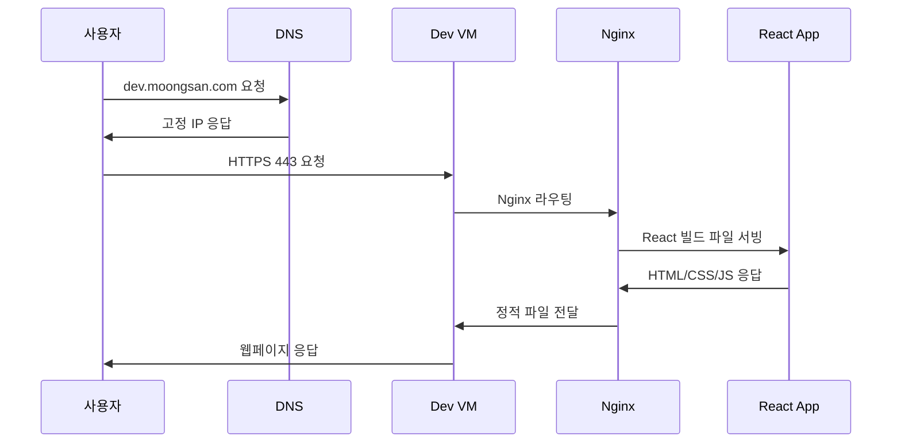
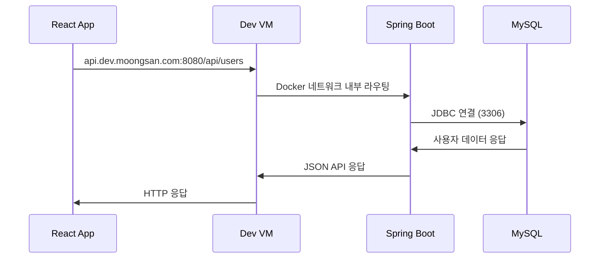
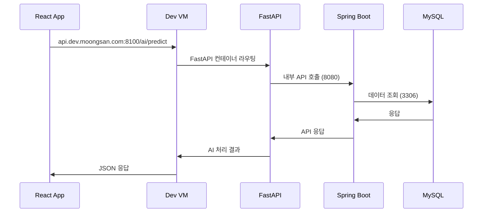
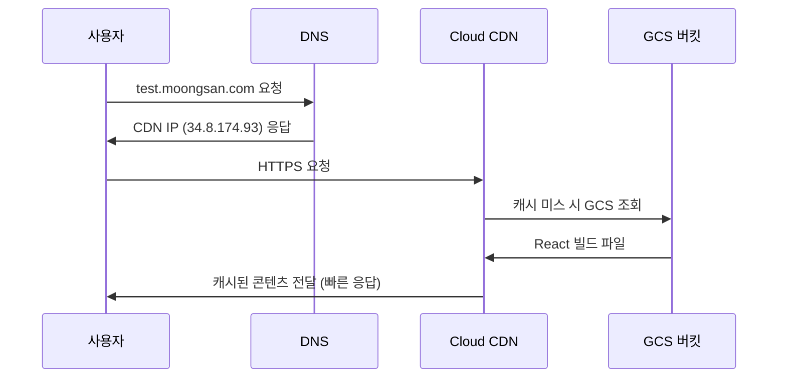
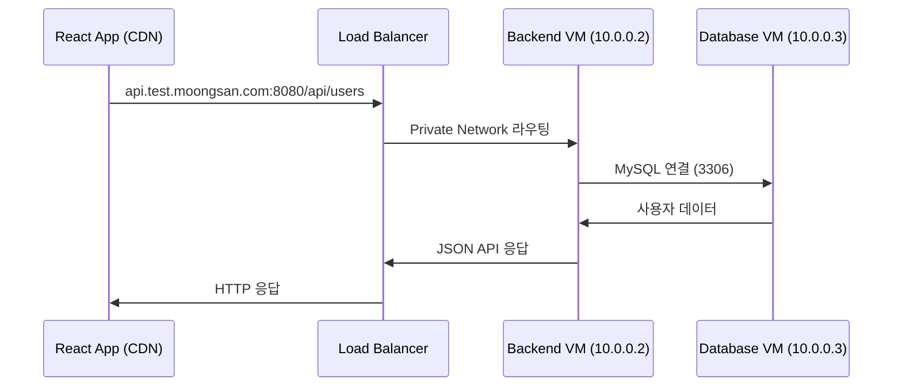
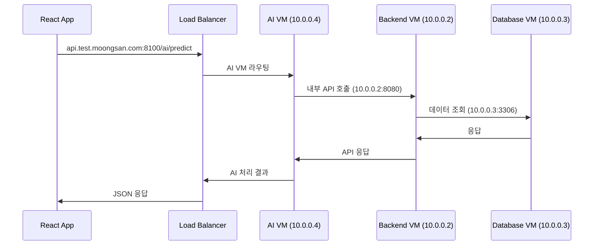
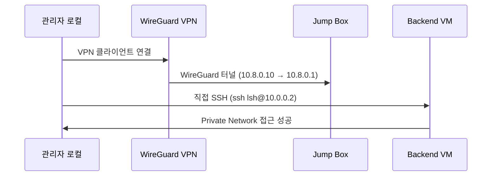
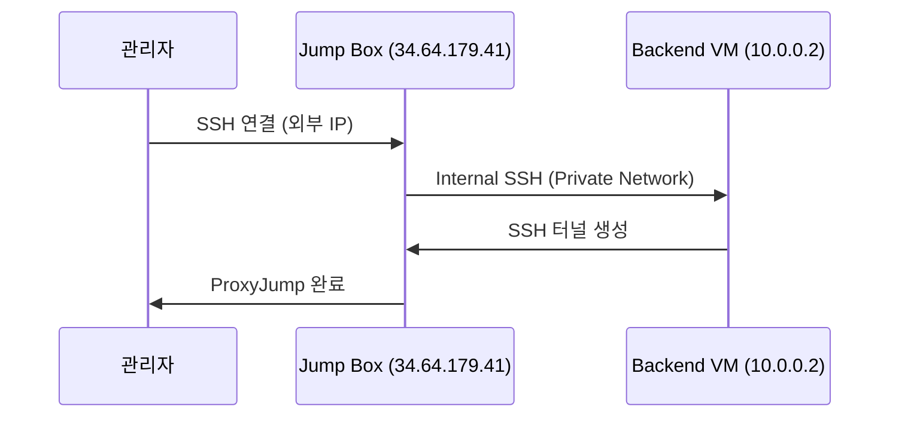
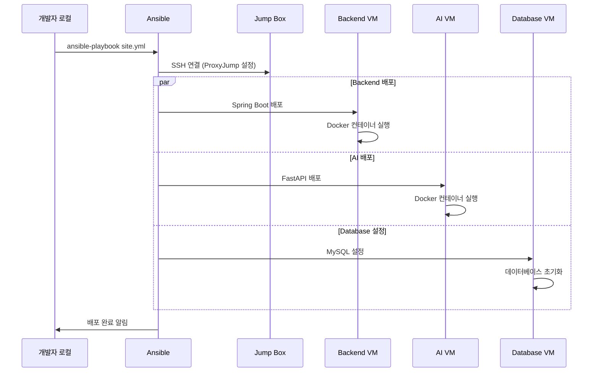

# 🏗️ 14-YG-CLOUD 아키텍처 통신 흐름 가이드

> **문서 작성일**: 2025년 6월 5일  
> **프로젝트**: 14-YG-CLOUD 3-Tier 아키텍처 마이그레이션  
> **목적**: Dev와 Test 환경의 네트워크 통신 흐름 상세 분석

## 📋 목차

1. [프로젝트 개요](#-프로젝트-개요)
2. [Dev 환경 (단일 VM)](#-dev-환경-단일-vm)
3. [Test 환경 (3-Tier)](#️-test-환경-3-tier)
4. [네트워크 보안 비교](#-네트워크-보안-비교)
5. [트러블슈팅 가이드](#-트러블슈팅-가이드)

---

## 🎯 프로젝트 개요

**14-YG-CLOUD**는 단일 VM에서 최적화된 3-Tier 아키텍처로의 마이그레이션 프로젝트입니다.

### 주요 목표
- ✅ **비용 최적화**: Frontend를 GCS + CDN으로 이전하여 VM 비용 절감
- ✅ **보안 강화**: Private Network + VPN 접근으로 보안 레벨 향상  
- ✅ **확장성 개선**: 서비스별 독립적 스케일링 가능
- ✅ **운영 자동화**: Terraform + Ansible로 IaC 구현

### 환경 구성
| 환경 | 목적 | 아키텍처 | 네트워크 |
|------|------|----------|----------|
| **Dev** | 개발/테스트 | 단일 VM (모노리틱) | Public Network |
| **Test** | 검증/스테이징 | 3-Tier 분리 | Private Network + VPN |
| **Prod** | 프로덕션 | 3-Tier 분리 | Private Network + VPN |

---

## 💻 Dev 환경 (단일 VM)

### 아키텍처 다이어그램
```
인터넷 ──> 고정 IP ──> 단일 VM (모든 서비스)
                     └── Docker 컨테이너들
                         ├── Frontend (React/Nginx)
                         ├── Backend (Spring Boot)  
                         ├── AI (FastAPI)
                         ├── Database (MySQL)
                         └── Redis
```

### 네트워크 구성
- **VM**: `moongsan-dev-vm`
- **네트워크**: Google Cloud default VPC
- **외부 IP**: 고정 IP 할당
- **열린 포트**: `22, 80, 443, 8080, 8100, 3000, 3100, 6379, 9090, 9100`

### 통신 흐름 시나리오

#### 1. 🌐 사용자 웹사이트 접속


**단계별 설명:**
1. 사용자가 `dev.moongsan.com:443` 접속
2. DNS에서 Dev VM의 고정 IP로 해석
3. VM 내 Nginx가 React 빌드 파일 서빙 (`/var/www/react`)
4. 사용자에게 웹페이지 전달

#### 2. 🔄 API 호출 (Frontend → Backend)


**단계별 설명:**
1. React 앱에서 API 요청: `api.dev.moongsan.com:8080/api/users`
2. 같은 VM 내부 Docker 네트워크로 Spring Boot 컨테이너 접근
3. Spring Boot가 MySQL 컨테이너와 통신 (포트 3306)
4. 데이터베이스 결과를 JSON으로 React에 응답

#### 3. 🤖 AI 서비스 호출


**단계별 설명:**
1. React에서 AI 서비스 요청: `api.dev.moongsan.com:8100/ai/predict`
2. VM 내 FastAPI 컨테이너로 라우팅
3. FastAPI가 Spring Boot에 내부 API 호출
4. Spring Boot가 데이터베이스 조회 후 AI 서비스에 응답
5. AI 처리 결과를 React에 전달

#### 4. 🔧 개발자 SSH 접근
```bash
# 직접 SSH 접근
ssh lsh@dev.moongsan.com

# Docker 컨테이너 관리
docker logs spring-backend
docker exec -it mysql-db mysql -u root -p
```

---

## 🏗️ Test 환경 (3-Tier)

### 아키텍처 다이어그램
```
인터넷 ──┬── CDN ──> GCS 버킷 (Frontend)
         │
         └── Load Balancer ──> Jump Box ──> Private Network
                                           ├── Backend VM (10.0.0.2)
                                           ├── AI VM (10.0.0.4)
                                           └── Database VM (10.0.0.3)
```

### 네트워크 구성
| 컴포넌트 | IP 주소 | 역할 | 접근 방식 |
|----------|---------|------|-----------|
| **Jump Box** | 34.64.179.41 (외부)<br/>10.0.0.5 (내부) | WireGuard VPN 서버<br/>Bastion Host | 직접 SSH |
| **Backend VM** | 10.0.0.2 | Spring Boot API | VPN/ProxyJump |
| **Database VM** | 10.0.0.3 | MySQL Database | VPN/ProxyJump |
| **AI VM** | 10.0.0.4 | FastAPI AI Service | VPN/ProxyJump |
| **GCS + CDN** | 34.8.174.93 | Frontend Static Hosting | HTTP/HTTPS |

### VPN 네트워크 (WireGuard)
| 클라이언트 | VPN IP | 목적 |
|------------|--------|------|
| **VPN 서버** | 10.8.0.1/24 | Jump Box WireGuard |
| **Frontend** | 10.8.0.10/32 | 개발자 로컬 접근 |
| **Backend** | 10.8.0.20/32 | Backend 서비스 전용 |
| **AI** | 10.8.0.30/32 | AI 서비스 전용 |
| **Database** | 10.8.0.40/32 | Database 전용 |

### 통신 흐름 시나리오

#### 1. 🌐 사용자 웹사이트 접속 (CDN 경로)


**특징:**
- ✅ **글로벌 CDN**: 전 세계 어디서나 빠른 속도
- ✅ **비용 효율**: VM 대신 저렴한 GCS 사용
- ✅ **자동 스케일링**: 트래픽 급증에도 안정적

#### 2. 🔄 API 호출 (Frontend → Backend)


**보안 특징:**
- 🔒 Backend VM은 Private IP만 보유 (외부 접근 불가)
- 🔒 Load Balancer를 통한 제어된 접근
- 🔒 내부 네트워크 통신 암호화

#### 3. 🤖 AI 서비스 호출


**확장성 특징:**
- 🚀 AI VM 독립적 스케일링 (CPU/Memory 최적화)
- 🚀 Backend와 분리되어 각각 다른 리소스 할당 가능
- 🚀 서비스별 독립적 배포 및 롤백

#### 4. 🔐 관리자 VPN 접근


**VPN 설정:**
```bash
# VPN 연결
sudo wg-quick up wg0

# 직접 접근
ssh lsh@10.0.0.2  # Backend VM
ssh lsh@10.0.0.3  # Database VM  
ssh lsh@10.0.0.4  # AI VM

# VPN 해제
sudo wg-quick down wg0
```

#### 5. 🚀 Jump Box ProxyJump 접근


**ProxyJump 명령어:**
```bash
# 한 번에 Backend VM 접근
ssh -J lsh@34.64.179.41 lsh@10.0.0.2

# Ansible에서 사용되는 방식
ansible -i inventory_test.ini test -m ping
```

#### 6. 🤖 Ansible 자동 배포


**Ansible 배포 순서:**
1. **Database VM**: MySQL 설치 및 초기화
2. **Backend VM**: Spring Boot + Redis 배포
3. **AI VM**: FastAPI 배포
4. **서비스 연결**: 내부 네트워크 통신 테스트

---

## 🔐 네트워크 보안 비교

### Dev 환경 보안 특징
| 항목 | 상태 | 설명 |
|------|------|------|
| **외부 노출** | ❌ 위험 | 모든 포트가 인터넷에 직접 노출 |
| **단일 장애점** | ❌ 위험 | VM 하나에 모든 서비스 집중 |
| **접근 제어** | ❌ 부족 | SSH만으로 모든 서비스 접근 |
| **네트워크 분리** | ❌ 없음 | 내부/외부 네트워크 구분 없음 |
| **개발 편의성** | ✅ 높음 | 단순한 구조로 빠른 개발 |

### Test 환경 보안 특징
| 항목 | 상태 | 설명 |
|------|------|------|
| **외부 노출** | ✅ 안전 | Private Network로 내부 서비스 보호 |
| **다중 보안층** | ✅ 강화 | Jump Box + VPN + 방화벽 |
| **접근 제어** | ✅ 세밀 | Role 기반 접근 제어 |
| **네트워크 분리** | ✅ 완전 | DMZ + Private Network 분리 |
| **암호화 통신** | ✅ 적용 | WireGuard VPN 암호화 |

### 방화벽 규칙 비교

#### Dev 환경 방화벽
```bash
# 모든 포트 개방 (위험)
Ports: 22, 80, 443, 8080, 8100, 3000, 3100, 6379, 9090, 9100
Source: 0.0.0.0/0 (전 세계)
```

#### Test 환경 방화벽
```bash
# SSH 접근 (Jump Box만)
moongsan-test-allow-ssh: 22 → Jump Box만
Source: 0.0.0.0/0

# Web 트래픽 (CDN/Load Balancer)  
moongsan-test-allow-web: 80, 443
Source: 0.0.0.0/0

# WireGuard VPN
moongsan-test-allow-wireguard: 51820/udp
Source: 0.0.0.0/0

# 내부 통신 (VPN + Private Network만)
moongsan-test-allow-internal: 3306, 6379, 8080, 8100, 9090, 9100, 3000
Source: 10.8.0.0/24, 10.0.0.0/24

# ICMP (ping)
moongsan-test-allow-icmp: icmp
Source: 10.8.0.0/24, 10.0.0.0/24
```

---

## 📊 트래픽 분리 및 성능

### Dev 환경 트래픽
```
모든 트래픽 → 단일 VM → Docker 내부 네트워크
- 병목: VM 리소스 한계
- 확장: 불가능 (Vertical Scaling만)
- 장애: 전체 서비스 중단
```

### Test 환경 트래픽
```
사용자 트래픽 → CDN → GCS (Frontend) ✅ 글로벌 고성능
API 트래픽 → Load Balancer → Private VMs ✅ 분산 처리  
관리 트래픽 → VPN/Jump Box → Private VMs ✅ 보안 접근
```

### 성능 최적화 결과
| 메트릭 | Dev 환경 | Test 환경 | 개선 효과 |
|--------|----------|-----------|-----------|
| **Frontend 로딩** | VM 처리 시간 | CDN 캐시 | ~70% 빨라짐 |
| **API 응답** | 단일 VM | 분산 VM | 확장 가능 |
| **데이터베이스** | 같은 VM | 전용 VM | 성능 안정 |
| **AI 처리** | 공유 리소스 | 전용 리소스 | 처리량 증가 |

---

## 🛠️ 트러블슈팅 가이드

### 자주 발생하는 문제와 해결책

#### 1. VPN 연결 실패
```bash
# 문제: WireGuard 연결 안됨
# 해결: 인터페이스 재시작
sudo wg-quick down wg0
sudo wg-quick up wg0

# 상태 확인
sudo wg show
```

#### 2. Jump Box SSH 연결 실패
```bash
# 문제: Permission denied
# 해결: SSH 키 권한 확인
chmod 600 ~/.ssh/lsh-study-key

# Jump Box 직접 접근
ssh -i ~/.ssh/lsh-study-key lsh@34.64.179.41
```

#### 3. 내부 VM 접근 실패
```bash
# 문제: Connection timed out
# 해결: VM 상태 및 방화벽 확인
gcloud compute instances list --filter="name:moongsan-test-*"
gcloud compute firewall-rules list --filter="name:moongsan-test-*"

# VM 재시작
gcloud compute instances start moongsan-test-backend --zone=asia-northeast3-a
```

#### 4. Ansible 배포 실패
```bash
# 문제: SSH 연결 실패
# 해결: 인벤토리 파일 확인
ansible -i ansible/inventory_test.ini test -m ping

# ProxyJump 설정 확인
cat ansible/inventory_test.ini
```

#### 5. CDN 캐시 문제
```bash
# 문제: Frontend 업데이트 안됨
# 해결: CDN 캐시 무효화
gcloud compute url-maps invalidate-cdn-cache moongsan-test-frontend-urlmap \
  --path "/*" --global
```

### 모니터링 명령어
```bash
# VM 상태 확인
gcloud compute instances list

# 방화벽 규칙 확인  
gcloud compute firewall-rules list

# VPN 상태 확인
sudo wg show

# Ansible 연결 테스트
ansible -i inventory_test.ini all -m ping

# 서비스 상태 확인
gcloud compute ssh moongsan-test-jumpbox --zone=asia-northeast3-a \
  --command="ping -c 3 10.0.0.2"
```

---

## 📚 추가 자료

- [Terraform 모듈 문서](../terraform/modules/README.md)
- [Ansible 플레이북 가이드](../ansible/README.md)  
- [WireGuard VPN 설정 가이드](./wireguard-setup.md)
- [GCS + CDN 설정 가이드](./gcs-cdn-setup.md)

---

**문서 마지막 업데이트**: 2025년 6월 5일  
**작성자**: DevOps Team  
**버전**: v2.0
