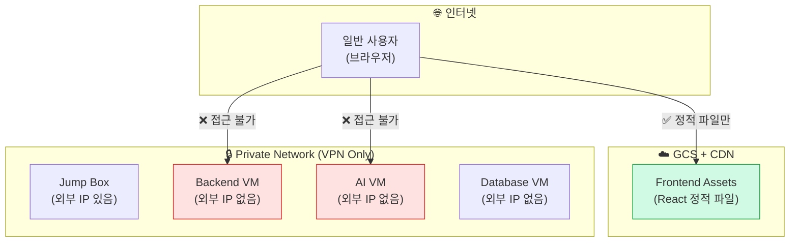
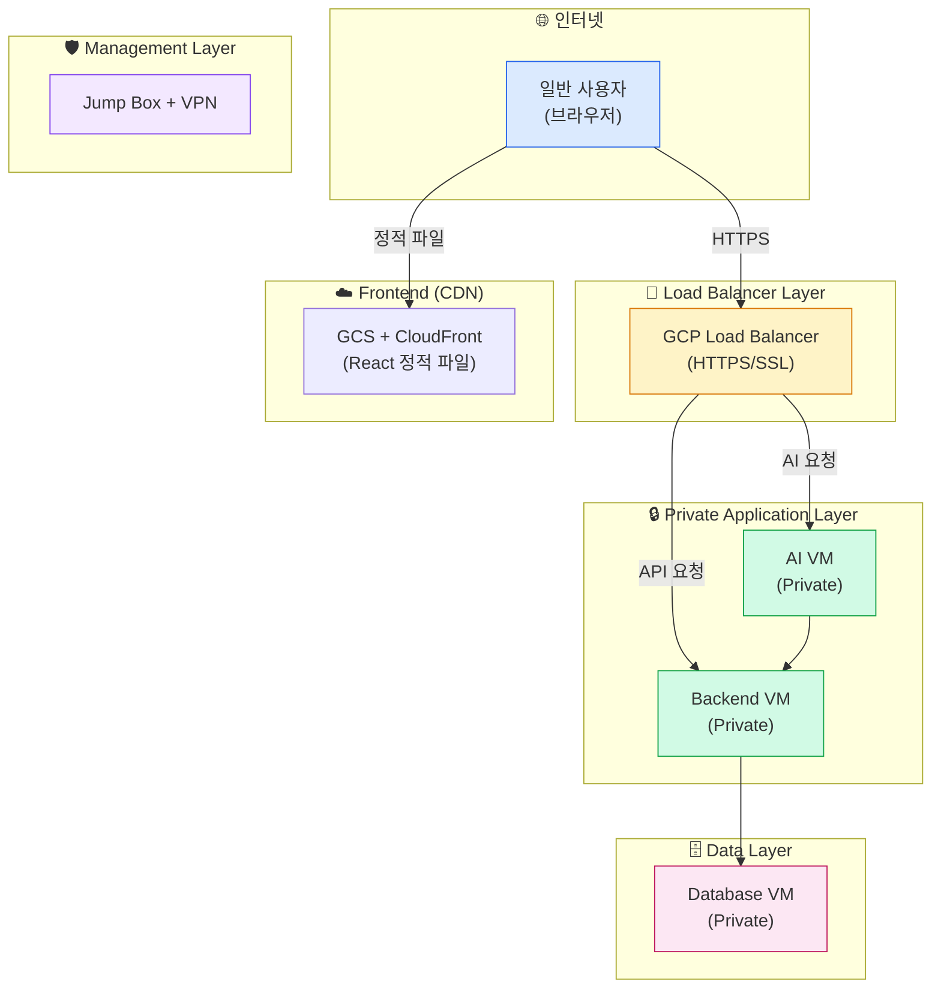

# 🚦 Load Balancer 누락 분석 및 해결 방안

## 🔍 **현재 구조 vs 원래 설계 차이점**

### ❌ **현재 구현된 구조 (문제점)**


### ✅ **원래 설계한 구조 (올바른 3-tier)**


## 🚨 **핵심 문제점**

### 1. **일반 사용자 접근 불가**
```bash
❌ Backend VM: assign_external_ip = false
❌ AI VM: assign_external_ip = false
❌ 로드밸런서: 존재하지 않음

결과: 브라우저에서 API 호출 불가!
```

### 2. **잘못된 3-Tier 구조**
```bash
현재: VPN-only Private Architecture
원래 설계: Public LB → Private Apps → Private DB
```

### 3. **Frontend-Backend 분리 실패**
```bash
Frontend: GCS (정적 파일만)
Backend API: 접근 불가 (Private VM)
→ SPA가 API를 호출할 수 없음!
```

## 🛠️ **해결 방안**

### **옵션 1: Load Balancer 추가 (권장)**
```hcl
# terraform/modules/load_balancer/main.tf 생성 필요

# HTTP(S) Load Balancer
resource "google_compute_global_address" "lb_ip" {
  name = "${var.project_name}-${var.env}-lb-ip"
}

resource "google_compute_global_forwarding_rule" "https" {
  name       = "${var.project_name}-${var.env}-https"
  target     = google_compute_target_https_proxy.proxy.id
  port_range = "443"
  ip_address = google_compute_global_address.lb_ip.address
}

resource "google_compute_backend_service" "backend_api" {
  name = "${var.project_name}-${var.env}-backend"
  
  backend {
    group = google_compute_instance_group.backend.id
  }
  
  health_checks = [google_compute_health_check.backend.id]
}

resource "google_compute_backend_service" "ai_api" {
  name = "${var.project_name}-${var.env}-ai"
  
  backend {
    group = google_compute_instance_group.ai.id
  }
  
  health_checks = [google_compute_health_check.ai.id]
}
```

### **옵션 2: 외부 IP 부여 (임시 해결)**
```hcl
# Backend VM에 외부 IP 부여
module "backend" {
  # ...기존 설정...
  assign_external_ip = true  # false → true로 변경
}

# AI VM에 외부 IP 부여
module "ai" {
  # ...기존 설정...
  assign_external_ip = true  # false → true로 변경
}
```

## 📊 **비용 영향 분석**

### Load Balancer 추가 비용:
```bash
HTTP(S) Load Balancer: $18/월 (기본)
외부 IP 2개 추가: $14.60/월 (Backend + AI)
────────────────────────────────
총 추가 비용: ~$32.60/월

하지만 적절한 3-tier 아키텍처 구현!
```

### 현재 최적화 + LB 총 비용:
```bash
기존 최적화된 인프라: $209.69/월
Load Balancer 추가: $32.60/월
────────────────────────────────
총합: $242.29/월

여전히 원래 계획($278)보다 저렴!
```

## 🎯 **권장 해결책**

### **1단계: Load Balancer 모듈 생성**
```bash
# 새 모듈 생성
mkdir -p terraform/modules/load_balancer
```

### **2단계: 기존 인프라에 LB 통합**
```hcl
# test/main.tf에 추가
module "load_balancer" {
  source = "../../modules/load_balancer"
  
  project_name = var.project_name
  env          = var.env
  region       = var.region
  
  backend_instance_group = module.backend.instance_group
  ai_instance_group      = module.ai.instance_group
}
```

### **3단계: DNS 설정**
```bash
api.test.moongsan.com → Load Balancer IP
test.moongsan.com → GCS (Frontend)
```

### **4단계: Health Check 구현**
```bash
Backend: /health 엔드포인트
AI: /health 엔드포인트
```

## 🤔 **왜 이런 차이가 발생했나?**

### **가능한 원인:**
1. **VPN 중심 설계**: WireGuard VPN을 통한 접근에 집중
2. **보안 우선**: 모든 VM을 Private으로 설정
3. **단계적 구현**: LB는 나중에 추가할 계획이었을 수 있음
4. **개발 환경 혼동**: Dev(단일 VM) 구조를 Test/Prod에도 적용

### **올바른 접근법:**
```bash
✅ 일반 사용자: Internet → LB → Private VMs
✅ 개발자/관리자: VPN → Private VMs (직접 접근)
✅ 진정한 3-tier: Web(LB) → App(VMs) → Data(DB)
```

## 🚀 **즉시 실행 가능한 해결책**

지금 당장 테스트하려면:

```bash
# 임시로 외부 IP 부여
terraform apply -var="backend_external_ip=true"
terraform apply -var="ai_external_ip=true"

# 방화벽 규칙 확인
# 포트 8080(Backend), 8100(AI) 오픈 필요
```

어떤 방향으로 진행하시겠습니까?

1. **Load Balancer 모듈 생성** (권장, 적절한 아키텍처)
2. **임시 외부 IP 부여** (빠른 테스트)
3. **현재 구조 유지** (VPN-only 접근)

---

> 💡 **결론**: 현재 구조는 **VPN 기반 Private Architecture**이고, 원래 설계는 **Public LB + Private Apps**였습니다. 일반 사용자 접근을 위해서는 Load Balancer가 필수입니다!
