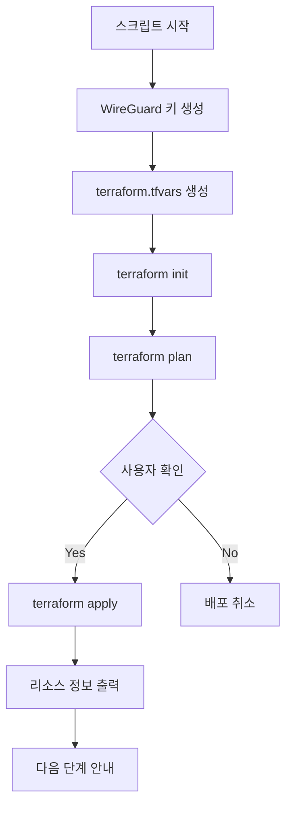
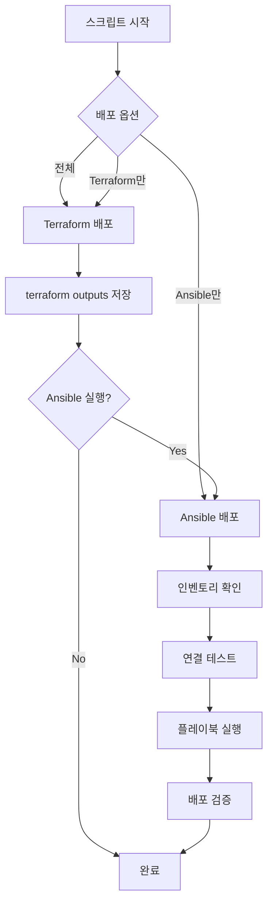
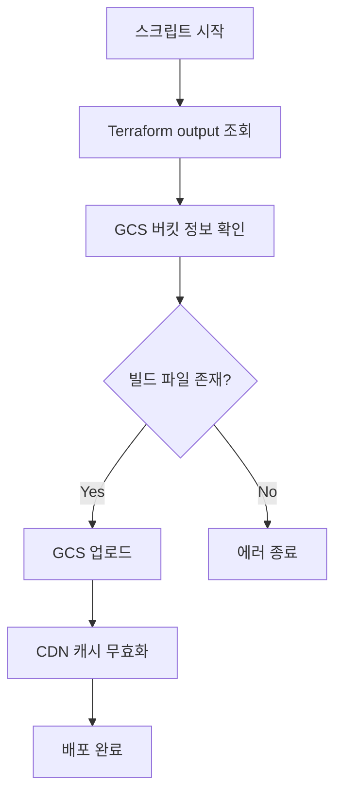
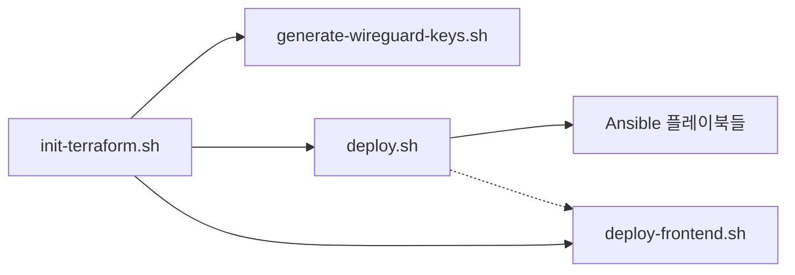

# 📋 14-YG-CLOUD Scripts 실행 흐름 가이드

## 🗂️ Scripts 디렉토리 구성

```
scripts/
├── init-terraform.sh        # 1️⃣ 초기 설정 및 인프라 배포
├── generate-wireguard-keys.sh # 🔑 WireGuard 키 생성 (내부적으로 호출됨)
├── deploy.sh                # 2️⃣ 통합 배포 스크립트 (Terraform + Ansible)
└── deploy-frontend.sh       # 3️⃣ Frontend 정적 파일 배포
```

## 🚀 전체 배포 흐름 (권장 순서)

### **Phase 1: 초기 설정** 🛠️
```bash
# 1. 프로젝트 초기 설정 및 인프라 배포
./scripts/init-terraform.sh test

# 내부 동작:
# ├─ WireGuard 키 생성 (generate-wireguard-keys.sh 호출)
# ├─ terraform.tfvars 파일 생성
# ├─ terraform init & plan
# ├─ 사용자 확인 후 terraform apply
# └─ 다음 단계 안내
```

### **Phase 2: 애플리케이션 배포** 🏗️
```bash
# 2. Backend/AI/Database 서비스 배포
./scripts/deploy.sh test

# 내부 동작:
# ├─ Terraform 재배포 (선택적)
# ├─ Ansible 인벤토리 확인
# ├─ Ansible 플레이북 실행
# └─ 배포 검증
```

### **Phase 3: Frontend 배포** 🌐
```bash
# 3. Frontend 정적 파일 배포
./scripts/deploy-frontend.sh test ../14-YG-FE/dist

# 내부 동작:
# ├─ Terraform output에서 GCS 버킷 정보 가져오기
# ├─ React 빌드 파일을 GCS에 업로드
# └─ CDN 캐시 무효화
```

## 📊 상세 스크립트 분석

### 1️⃣ **init-terraform.sh** - 초기 설정 마스터

```bash
# 사용법
./scripts/init-terraform.sh [environment]
./scripts/init-terraform.sh test  # 기본값: test
```

#### 🔄 **실행 흐름**


#### ✅ **수행 작업**
- 🔑 **WireGuard 키 자동 생성**
- 📄 **terraform.tfvars 파일 생성** (example에서 복사)
- 🏗️ **인프라 리소스 배포** (VPC, VM, GCS, CDN 등)
- 📊 **배포 정보 출력**

#### 📤 **생성되는 리소스**
- ☁️ VPC 네트워크 (10.0.0.0/24)
- 🖥️ Jump Box VM (WireGuard 서버)
- 🖥️ Backend/AI/Database VM들
- 📦 GCS 버킷 (Frontend 호스팅용)
- 🌐 CDN (Cloud Load Balancer)

---

### 2️⃣ **deploy.sh** - 통합 배포 엔진

```bash
# 사용법
./scripts/deploy.sh [environment] [options]

# 예시
./scripts/deploy.sh test                    # 전체 배포
./scripts/deploy.sh test --terraform-only   # Terraform만
./scripts/deploy.sh test --ansible-only     # Ansible만
```

#### 🔄 **실행 흐름**


#### ✅ **수행 작업**
- 🏗️ **Terraform 인프라 배포/업데이트**
- 📤 **Terraform outputs을 JSON으로 저장**
- 🤖 **Ansible 플레이북 실행**
- 🔍 **배포 후 검증**

#### 🎯 **Ansible 태그 옵션**
- `base` - 기본 시스템 설정
- `common` - 공통 설정
- `database` - PostgreSQL 설정
- `backend` - Backend API 서비스
- `ai` - AI 서비스
- `nginx` - Nginx 프록시
- `monitoring` - 모니터링 설정

---

### 3️⃣ **deploy-frontend.sh** - Frontend 배포 전용

```bash
# 사용법
./scripts/deploy-frontend.sh [environment] [build_path]
./scripts/deploy-frontend.sh test ../14-YG-FE/dist
```

#### 🔄 **실행 흐름**


#### ✅ **수행 작업**
- 📊 **Terraform output에서 GCS 정보 조회**
- 📤 **React 빌드 파일을 GCS에 업로드**
- 🔄 **CDN 캐시 무효화** (선택사항)
- 🌍 **Frontend URL 안내**

---

### 🔑 **generate-wireguard-keys.sh** - 키 생성 도구

```bash
# 직접 실행 (일반적으로 init-terraform.sh에서 자동 호출)
./scripts/generate-wireguard-keys.sh
```

#### ✅ **수행 작업**
- 🔐 **서버 키 생성** (Jump Box용)
- 🔐 **클라이언트 키 4개 생성** (frontend, backend, ai, database)
- 📄 **terraform.tfvars.example 생성**
- 💾 **키 파일들을 wireguard-keys/ 디렉토리에 저장**

## 🗺️ 실제 사용 시나리오

### 🎯 **시나리오 1: 완전 새로운 환경 구축**

```bash
# 1단계: 초기 인프라 배포
./scripts/init-terraform.sh test
# ✅ VPC, VM들, GCS, CDN 모두 생성됨

# 2단계: 애플리케이션 배포
./scripts/deploy.sh test
# ✅ Docker, PostgreSQL, Backend API, AI 서비스 모두 설정됨

# 3단계: Frontend 배포
./scripts/deploy-frontend.sh test ../14-YG-FE/dist
# ✅ React 앱이 GCS + CDN으로 배포됨
```

### 🎯 **시나리오 2: 애플리케이션만 재배포**

```bash
# Ansible만 실행 (인프라는 그대로)
./scripts/deploy.sh test --ansible-only
```

### 🎯 **시나리오 3: Frontend만 업데이트**

```bash
# Frontend 빌드 후 배포
cd ../14-YG-FE
npm run build
cd ../14-YG-CLOUD
./scripts/deploy-frontend.sh test ../14-YG-FE/dist
```

### 🎯 **시나리오 4: 특정 서비스만 배포**

```bash
# Backend만 재배포
./scripts/deploy.sh test --ansible-only
# 태그 입력: backend

# Database만 재설정
./scripts/deploy.sh test --ansible-only
# 태그 입력: database
```

## 🔄 스크립트 간 의존성



### 📋 **의존성 설명**
- `init-terraform.sh` → `generate-wireguard-keys.sh` (자동 호출)
- `init-terraform.sh` 완료 후 → `deploy.sh` 실행 가능
- `init-terraform.sh` 완료 후 → `deploy-frontend.sh` 실행 가능
- `deploy.sh`와 `deploy-frontend.sh`는 독립적 실행 가능

## ⚠️ 주의사항

### 🔒 **보안**
- terraform.tfvars 파일은 Git에 커밋하지 않음
- WireGuard 키 파일들은 안전하게 보관
- Pre-commit hook이 민감한 파일 커밋을 자동 차단

### 🗂️ **파일 관리**
- `terraform.tfvars` - 실제 설정 (Git 제외)
- `terraform.tfvars.example` - 예시 템플릿 (Git 포함)
- `wireguard-keys/` - 생성된 키들 (Git 제외)

### 🔧 **실행 환경**
- gcloud CLI 인증 필요
- Terraform 설치 필요
- Ansible 설치 필요 (Python)
- WireGuard tools 설치 필요

## 🎉 정리

**이 스크립트들은 완전한 자동화 파이프라인을 제공합니다:**

1. **🏗️ 인프라 구축** → `init-terraform.sh`
2. **🤖 서비스 배포** → `deploy.sh`  
3. **🌐 Frontend 배포** → `deploy-frontend.sh`

**각 스크립트는 독립적으로도 실행 가능하며, 상황에 맞는 배포 전략을 선택할 수 있습니다!** 🚀
