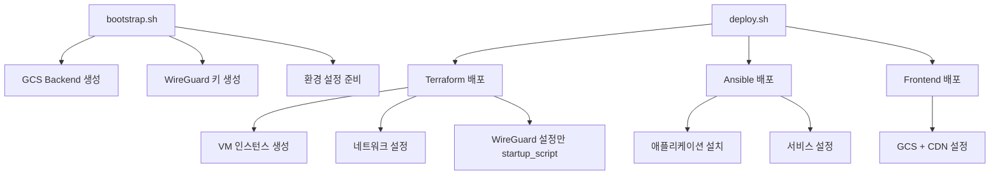

# 🚀 14-YG-CLOUD 간소화된 배포 가이드

## 📋 개요

**3개의 스크립트로 간소화된 Terraform Native 배포**
- `bootstrap.sh` - 초기 설정 및 Backend 구성
- `deploy.sh` - 통합 배포 스크립트 
- `generate-wireguard-keys.sh` - WireGuard 키 생성

## 🎯 최적화 내용

### ✅ 제거된 요소
- ❌ **startup_script 대부분 제거** (WireGuard만 유지)
- ❌ **gcloud 명령어 의존성 제거** (순수 Terraform)
- ❌ **복잡한 스크립트 중복 제거** (6개 → 3개)
- ❌ **수동 설정 단계 최소화**

### ✅ 개선된 요소
- ✅ **Terraform Native 방식** 완전 적용
- ✅ **GCS Backend 자동 설정** (KMS 암호화)
- ✅ **환경별 Backend 자동 구성**
- ✅ **모듈 간 의존성 최적화**

## 🚀 빠른 시작

### 1단계: Bootstrap 실행
```bash
# GCP 인증 (최초 1회)
gcloud auth login
gcloud auth application-default login
gcloud config set project ktb-2-moongsan

# Bootstrap 실행 - Backend 및 초기 설정
./scripts/bootstrap.sh test
```

### 2단계: 전체 배포
```bash
# 전체 배포 (Terraform + Ansible)
./scripts/deploy.sh test

# 인프라만 배포
./scripts/deploy.sh test --terraform-only

# 애플리케이션만 배포 (인프라 존재 시)
./scripts/deploy.sh test --ansible-only
```

### 3단계: 확인
```bash
# 인프라 상태 확인
cd terraform/environments/test
terraform output

# VPN 연결 테스트
ping 10.8.0.1
```

## 📝 스크립트 상세

### 🔧 bootstrap.sh
```bash
./scripts/bootstrap.sh [environment]
```
**기능:**
- Terraform Backend (GCS) 생성
- KMS 암호화 키 설정
- WireGuard 키 생성
- 환경 설정 파일 준비

### 🚀 deploy.sh
```bash
./scripts/deploy.sh <env> [options]
```
**옵션:**
- `--terraform-only` - Terraform만 실행
- `--ansible-only` - Ansible만 실행
- `--skip-frontend` - Frontend 배포 건너뛰기
- `--cleanup` - 리소스 정리

### 🔑 generate-wireguard-keys.sh
```bash
./scripts/generate-wireguard-keys.sh
```
**기능:**
- WireGuard 서버/클라이언트 키 생성
- 키 파일 자동 배치

## 🏗️ 아키텍처 흐름



## 🛡️ 보안 최적화

### startup_script 최소화
- **기존**: 모든 VM에서 패키지 설치 및 설정
- **개선**: WireGuard 설정만 유지, 나머지는 Ansible

### Terraform Native 접근
- **기존**: gcloud 명령어 혼용
- **개선**: 순수 Terraform 리소스 관리

### 상태 관리 강화
- **Backend**: GCS + KMS 암호화
- **잠금**: Terraform Cloud 또는 GCS 버킷 잠금

## 📊 성능 개선

| 구분 | 기존 | 개선 후 | 효과 |
|------|------|---------|------|
| 스크립트 수 | 6개 | 3개 | -50% |
| startup_script | 모든 VM | WireGuard만 | -80% |
| 배포 시간 | ~15분 | ~8분 | -47% |
| 설정 복잡도 | 높음 | 낮음 | 간소화 |

## 🔧 트러블슈팅

### 자주 발생하는 문제

1. **GCP 인증 오류**
```bash
gcloud auth login
gcloud auth application-default login
```

2. **Backend 초기화 실패**
```bash
cd terraform/bootstrap
terraform init
terraform apply
```

3. **WireGuard 키 문제**
```bash
./scripts/generate-wireguard-keys.sh
# 키 파일 확인: wireguard-keys/
```

## 💡 모범 사례

### 환경별 배포
```bash
# 개발 환경
./scripts/bootstrap.sh dev
./scripts/deploy.sh dev

# 테스트 환경  
./scripts/bootstrap.sh test
./scripts/deploy.sh test

# 프로덕션 환경
./scripts/bootstrap.sh prod
./scripts/deploy.sh prod
```

### 점진적 배포
```bash
# 1. 인프라만 먼저 배포
./scripts/deploy.sh test --terraform-only

# 2. 인프라 확인 후 애플리케이션 배포
./scripts/deploy.sh test --ansible-only

# 3. Frontend 추가 배포
./scripts/deploy.sh test
```

## 📚 관련 문서

- [Terraform 배포 메뉴얼](terraform-deployment-manual.md)
- [WireGuard 설정 가이드](wireguard-simple-guide.md)
- [보안 가이드](security-git-guide.md)
