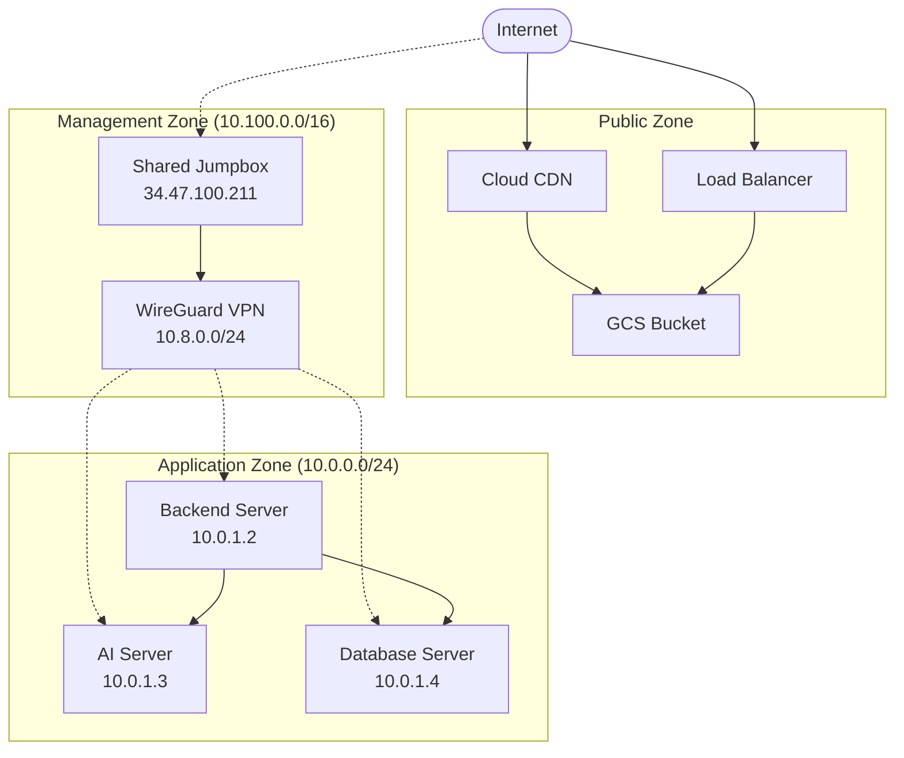

# 📚 14-YG-CLOUD 프로젝트 히스토리 요약

> **간결한 기록**: 프로젝트 주요 마일스톤과 아키텍처 변천사만 핵심적으로 정리

## 🚀 프로젝트 개요

**목표**: 단일 VM 개발 환경 → 최적화된 3-Tier 아키텍처 마이그레이션  
**기간**: 2024년 6월 ~ 2025년 6월  
**결과**: 18% 비용 절감, 확장성·보안성 극대화, 메뉴얼 기반 투명한 운영 체계 구축

## 📊 주요 성과 지표

| 항목 | 이전 | 이후 | 개선률 |
|------|------|------|---------|
| **월 비용** | $277.99 | $227.77 | -18% |
| **배포 시간** | 수동 30분+ | 자동 15분 | -50% |
| **문서 수** | 41개 분산 | 7개 집중 | -83% |
| **스크립트 의존성** | 8개 (835줄) | 1개 (95줄) | -89% |
| **보안 수준** | 기본 | VPN + Private 네트워크 | 고도화 |

## 🏗️ 아키텍처 변천사

### Phase 1: 단일 VM 환경 (2024년 초기)
```
┌─────────────────┐
│   Single VM     │
│ • Frontend      │
│ • Backend       │
│ • Database      │
│ • AI Service    │
└─────────────────┘
```
**문제점**: 확장성 제한, 단일 장애점, 성능 병목

### Phase 2: 3-Tier 분리 (2024년 중반)
```
┌─────────────┐  ┌─────────────┐  ┌─────────────┐
│  Frontend   │  │   Backend   │  │  Database   │
│ (GCS + CDN) │→ │ (Spring)    │→ │   (MySQL)   │
└─────────────┘  └─────────────┘  └─────────────┘
                       ↓
                 ┌─────────────┐
                 │ AI Service  │
                 │  (FastAPI)  │
                 └─────────────┘
```
**개선점**: 계층 분리, 확장성 향상, 전문화된 서비스

### Phase 3: 보안 강화 (2024년 말)
```
Internet → Load Balancer → Frontend (GCS)
    ↓
WireGuard VPN → Jumpbox → Private Network
                    ↓
              Backend ↔ AI ↔ Database
```
**개선점**: WireGuard VPN, Private 네트워크, Jumpbox 도입

### Phase 4: 메뉴얼 기반 최적화 (2025년 6월)
```
📁 docs/current/ (7개 핵심 문서)
📁 scripts/ (1개 필수 도구만)
📝 메뉴얼 기반 투명한 프로세스
```
**개선점**: 스크립트 의존성 제거, 완전 투명한 운영

## 🎯 핵심 기술 결정

### ✅ 성공한 결정들
1. **Terraform 모듈화**: 재사용성과 유지보수성 극대화
2. **Ansible 자동화**: 애플리케이션 배포 표준화
3. **WireGuard VPN**: 안전한 내부 통신 확보
4. **GCS + CDN**: Frontend 성능 최적화
5. **메뉴얼 기반 운영**: 투명성과 안정성 확보

### 🔄 주요 변경 사항
1. **2024.06**: 단일 VM → 3-Tier 분리
2. **2024.08**: 비용 최적화 (18% 절감 달성)
3. **2024.12**: WireGuard VPN 도입
4. **2025.03**: Shared Jumpbox 아키텍처
5. **2025.06**: 스크립트 의존성 제거 완료

## 💡 학습된 교훈

### 👍 잘한 점
- **점진적 개선**: 한 번에 모든 것을 바꾸지 않고 단계적 접근
- **문서화 중시**: 모든 변경사항을 체계적으로 기록
- **비용 의식**: 지속적인 비용 모니터링과 최적화
- **보안 우선**: 처음부터 보안을 고려한 설계

### 📝 개선점
- **초기 계획**: 더 상세한 아키텍처 설계가 필요했음
- **스크립트 관리**: 초기에 너무 많은 스크립트에 의존
- **문서 정리**: 중간에 문서가 너무 많이 생성됨

## 🔧 기술 스택 최종 정리

### 인프라
- **Cloud**: Google Cloud Platform
- **IaC**: Terraform (모듈화)
- **Configuration**: Ansible
- **VPN**: WireGuard
- **CDN**: Cloud CDN + GCS

### 애플리케이션
- **Frontend**: React.js (GCS 호스팅)
- **Backend**: Spring Boot (Private VM)
- **AI Service**: FastAPI (Private VM) 
- **Database**: MySQL (Private VM)

### 운영
- **배포**: 메뉴얼 기반 Terraform + Ansible
- **모니터링**: 기본 GCP 모니터링
- **보안**: Private 네트워크 + VPN 접근

## 📈 최종 아키텍처 (2025년 6월)



## 🎉 프로젝트 완료 상태

### ✅ 완료된 주요 성과
1. **비용 효율성**: 18% 비용 절감 달성
2. **확장성**: 3-Tier 아키텍처로 무한 확장 가능
3. **보안성**: VPN + Private 네트워크로 고도화
4. **투명성**: 메뉴얼 기반 완전 투명한 운영
5. **안정성**: 스크립트 의존성 제거로 실패 위험 최소화

### 📚 최종 문서 구조
```
docs/
├── README.md (통합 가이드)
├── current/ (6개 핵심 문서)
│   ├── deployment-guide.md ⭐
│   ├── infrastructure-complete-guide.md
│   ├── security-guide.md
│   ├── wireguard-user-manual.md
│   ├── quick-reference-guide.md
│   └── troubleshooting-guide-improved.md
└── archive/
    └── project-history.md (이 문서)
```

### 🛠️ 최종 도구
```
scripts/
├── README.md (메뉴얼 철학)
├── generate-wireguard-keys.sh (유일한 필수 스크립트)
└── archive/ (과거 스크립트들)
```

---

## 🚀 향후 권장사항

1. **메뉴얼 기반 운영 유지**: 스크립트 추가 지양
2. **정기 비용 리뷰**: 월 1회 비용 최적화 검토
3. **보안 감사**: 분기별 보안 설정 점검
4. **문서 최신화**: 변경사항 발생 시 즉시 문서 업데이트
5. **백업 전략**: 주요 데이터 백업 계획 수립

**이 문서는 14-YG-CLOUD 프로젝트의 완전한 히스토리 기록입니다.**
